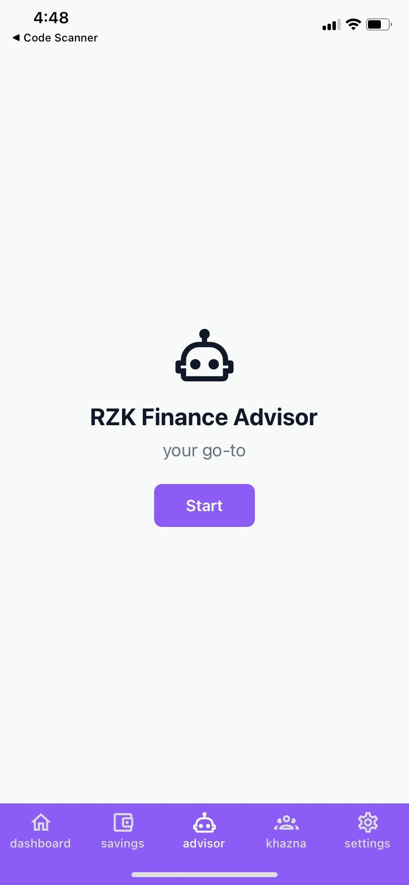
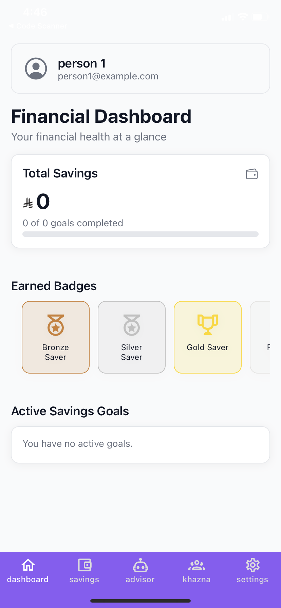
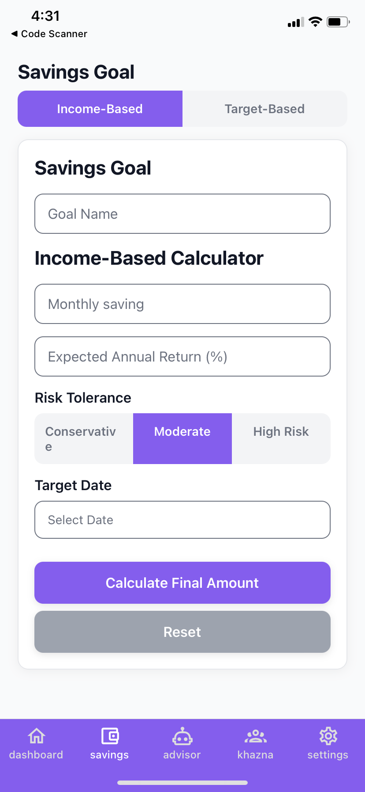

# 💰 RZK — Financial Awareness App for Saudi Youth

RZK is a mobile app built with Expo + React Native as part of the **Financial Awareness and Literacy** track.

The goal of RZK is simple: help Saudi youth understand investing and saving in a way that actually makes sense.

The app combines financial education, savings planning, and an AI-powered chatbot that recommends personalized investment plans focused on local Saudi companies and opportunities.

---

## ✨ Features

- 🤖 AI chatbot that suggests personalized investment plans
- 🇸🇦 Focus on Saudi companies and local investment options
- 🎯 Savings goal planner and tracker
- 📚 Simple explanations of investing concepts for beginners
- 📱 Clean, beginner-friendly mobile UI

---

## 📸 App Screenshots

| Home Screen | AI Chatbot | Savings Planner |
|:-----------:|:----------:|:---------------:|
|  |  |  |

---

## 🛠️ Built With

- [Expo](https://expo.dev/)
- React Native
- Expo Router (file-based routing)
- AI integration for chatbot logic

---

## 🚀 Running the Project

1. **Install dependencies**

   ```bash
   npm install
   ```

2. **Start the app**

   ```bash
   npx expo start
   ```

Open in your preferred environment:

- Android Emulator
- iOS Simulator
- [Expo Go](https://expo.dev/go)

---


## 📚 Learn More About Expo

- [Expo Documentation](https://docs.expo.dev)
- [Expo Go](https://expo.dev/go)
